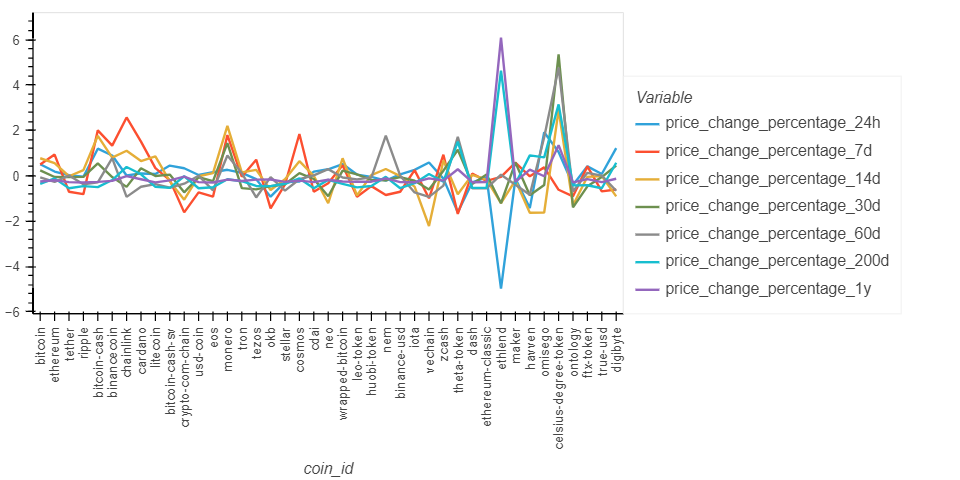

# CryptoClustering
## Challenge No 19

In this folder you will find:

- A subfolder called *Resources* with the **market_data.csv** file containing the cypto currencies returns in time.

- A subfolder called *Images* with the images of the output.

- A file called **Crypto_clustering.ipynb** with the code for the analysis.

- This **Readme.md** file.

-----
-----

We performed a series of tests against different currencies in the crypto market in order to see if the changes in the last 24 hours and 7 days affect the price of the coins. 

1. As a first step we noticed the returns in different periods of time differed widely so we standarize them.We can see how the data changed by looking the graphs displayed below.

Original Data:

Standarized Data:

Look how the magnitudes changed to a more homegenized sample:

2. With this data we calculated the best fit for the data by runnig a loop for the clusters using the Kmeans algorithm. 

With the inertia calculated we applied the elbow method and graphed it. Looking at the elbow curve the best value for k would be 4, which is the point where the clusters' inertia explained is big enough (72% of the total inertia), while the inertia explained by any additional k doesn't add significant value. 

In the image below we can see 4 clusters are the optimal for this sample. 

3. So we plot the results for the Kmeans algorithm in 2D and obtained a graph like this:

The graph achieves an acceptable separation of the clusters, however these are still very disperesed from within and there is not a clear separation between groups 1 and 2 and the lower portion of 3. 

4. After this we performed a Principal Components Analysis to see if the clustering can be optimized. This analysis considered 3 principal components. 

5. The elbow method threw a k = 4 as the best fit for the model. This is equal to the one calculated with the original data. 

6. With this tecnique we were able to calculate the variance explained by these components: PCA1 alone explained 37.20%, PCA2 34.70 and PCA3 17.60%, which combined adds up to **89.5% of the data total variance**.

7. Looking at the clusters graph we can see clusters two and three consisting of one point each, being *ethlem* the only element in cluster 2 and *celsius degrees token* the only in cluster 3. 

These findings are supported by the Returns graph where we can see these coins have the biggest fluctuations in the sample. 

The graph of clusters is displayed below:

8. After looking at the data we conclude that the utilization of Principal Components Analysis made the calculations more efficient. In the graphs we can see more inertia explained by using PC's instead of the original data. Also the clusters are better defined once PCA is used (compared against the first attempt by using Kmeans on the original data).

